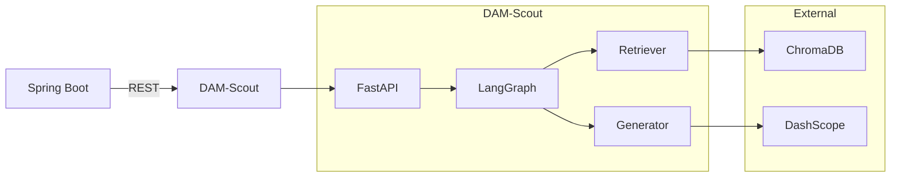
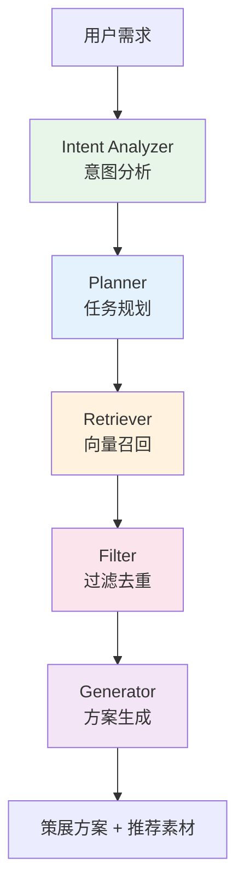

# DAM-Scout 智能素材策展助手

基于 RAG + LangGraph 的智能素材策展引擎。用户输入自然语言需求，系统自动分析意图、规划检索任务、从向量数据库中召回匹配素材，由 LLM 生成专业策展方案。


---

## 系统架构



### LangGraph 5 节点工作流



## 功能特性

### 策展搜索（主接口）
- 用户输入自然语言需求（如"电商大促的科技感横幅"）
- 自动提取行业、用途、场景、风格 4 类结构化意图
- 基于意图生成 2-3 组多路检索任务，提高召回覆盖率
- Top-5 语义检索 + 元数据过滤 + 结果去重
- 大模型生成包含主视觉推荐、配色建议、搭配说明的策展方案

### 向量管理
- 图片入库：元信息向量化存入 ChromaDB（1024 维）
- 增删改同步：Spring Boot 通过 @Async 自动同步
- 批量导入脚本：MySQL → ChromaDB 全量同步

### 双模式 LLM
- **云端模式**：DashScope Qwen-Turbo（默认，速度快）
- **本地模式**：Ollama Qwen3:4b（离线可用）

## 服务访问

| 服务 | 地址 | 说明 |
|------|------|------|
| RAG 服务 | http://localhost:8000 | FastAPI 主服务 |
| Swagger 文档 | http://localhost:8000/docs | API 接口文档 |
| 前端页面 | http://localhost:5173/ai_search | AI 搜图页面 |
| 后端中转 | http://localhost:8123/api/ai/search | Spring Boot 转发接口 |

## API 接口

### POST /scout/search — 策展搜索

**请求：**

```json
{
  "query": "给电商大促准备一组科技感的横幅和背景图",
  "top_k": 5
}
```

**响应：**

```json
{
  "intent": {
    "industry": "电商",
    "purpose": "大促活动",
    "scene": "线上推广",
    "style": "科技感"
  },
  "tasks": [
    { "task_type": "banner", "description": "..." }
  ],
  "recommendations": [
    {
      "pictureId": "1001",
      "title": "蓝色科技横幅",
      "category": "banner",
      "score": 0.92,
      "task_type": "banner",
      "reason": "深蓝渐变背景搭配几何线条，符合科技感调性"
    }
  ],
  "answer": "根据您的需求分析，为您策划了一组科技感素材..."
}
```

### 向量管理

| 方法 | 路径 | 说明 |
|------|------|------|
| POST | `/embedding/add` | 图片入库，生成向量 |
| DELETE | `/embedding/{pictureId}` | 删除图片向量 |
| PUT | `/embedding/update` | 更新图片向量 |

### POST /rag/search — 基础 RAG 搜图

```json
{ "query": "科技感背景", "top_k": 5 }
```

## 快速开始

### 环境要求

- Python 3.11+
- DashScope API Key（[阿里百炼控制台](https://bailian.console.aliyun.com/) 获取）

### 1. 克隆 & 创建虚拟环境

```bash
git clone https://github.com/konlue/dam-scout.git
cd dam-scout
python -m venv venv
venv\Scripts\activate        # Windows
# source venv/bin/activate   # macOS / Linux
```

### 2. 安装依赖

```bash
pip install -r requirements.txt
```

### 3. 配置环境变量

```bash
cp .env.example .env
```

编辑 `.env`，填入 DashScope API Key：

```env
MODEL_PROVIDER=dashscope
DASHSCOPE_API_KEY=sk-your-actual-key-here
```

### 4. 启动服务

```bash
uvicorn app.main:app --reload --port 8000
```

访问 http://localhost:8000/docs 查看 Swagger 文档。

### 5. 向量数据同步

首次使用需要将图片数据同步到 ChromaDB 向量数据库：

```bash
# 编辑 sync_embeddings.py 中的数据库连接信息后执行
python sync_embeddings.py
```

后续图片的增删改会通过 Spring Boot 自动同步向量。

## 配置说明

| 环境变量 | 默认值 | 说明 |
|----------|--------|------|
| `MODEL_PROVIDER` | `dashscope` | `dashscope` 或 `ollama` |
| `DASHSCOPE_API_KEY` | — | 阿里百炼 API Key |
| `LLM_MODEL` | `qwen-turbo` | 百炼 LLM 模型名称 |
| `EMBEDDING_MODEL` | `text-embedding-v3` | 百炼 Embedding 模型名称 |
| `OLLAMA_BASE_URL` | `http://localhost:11434` | Ollama 地址 |
| `OLLAMA_LLM_MODEL` | `qwen3:4b` | Ollama 模型 |
| `CHROMA_PERSIST_DIR` | `./chroma_data` | ChromaDB 存储目录 |
| `CHROMA_COLLECTION_NAME` | `picture_embeddings` | 集合名称 |
| `RAG_TOP_K` | `5` | 检索返回数量 |

### 本地离线模式

```env
MODEL_PROVIDER=ollama
```

需提前安装 [Ollama](https://ollama.com) 并拉取模型：`ollama pull qwen3:4b`

## Spring Boot 集成

| 文件 | 说明 |
|------|------|
| `AIController.java` | AI 接口控制器 |
| `AIManager.java` | 调用本服务的客户端封装 |
| `AIEmbeddingRequest.java` | 向量入库请求 DTO |
| `AISearchRequest.java` | 搜索请求 DTO |
| `AISearchResponse.java` | 搜索响应 DTO |

前端调用 `POST /api/ai/search`，由 Spring Boot 转发到本服务（默认 `http://localhost:8000`）。

## 效果展示

**AI 搜图主页**


**策展结果**


## 许可证

本项目仅供交流学习使用。
